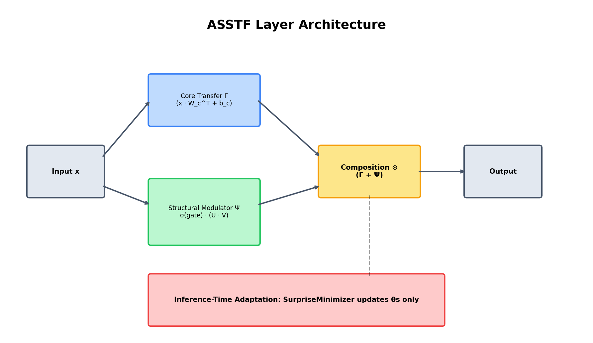
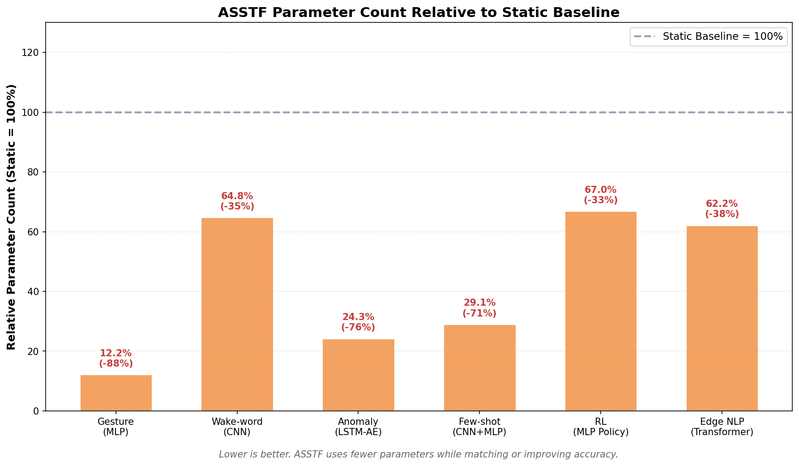

# Project_LeanAI - ASSTF Stage 1

ASSTF (Adaptive State-Space Transfer Function): A PyTorch framework for dynamic neural topology that reduces parameters by 5-10x, enables test-time adaptation, and outperforms static models on structure-sensitive tasks.

Project_LeanAI is a source-available research implementation of Adaptive State-Space Transfer Functions (ASSTF) for non-commercial research and educational use.

&nbsp;

---

<div align="center">
  
  <h1>LeanAI ASSTF</h1>
  <p><strong>Adaptive State-Space Transfer Function</strong></p>
</div>

---

&nbsp;

[](https://www.python.org/downloads/)
[](https://pytorch.org/)
[](LICENSE)
[](tests/)

> **Tiny, self-adapting neural layers for efficient edge AI and continual learning.**

ASSTF (Adaptive State-Space Transfer Function) is a PyTorch framework that lets neural layers continuously reconfigure their effective state space through a small set of **structural parameters**. It combines **parameter-efficient learning** with **inference-time adaptation**, making it ideal for edge devices, personalization, and continual learning.

Project_LeanAI is a source-available research implementation of Adaptive State-Space Transfer Functions (ASSTF). It is licensed under the LeanAI ASSTF Community License for non-commercial research and educational use. For commercial use, SaaS deployment, or redistribution in products, please contact Safeware Technologies for a commercial license.

---

[](https://colab.research.google.com/github/safeware/Project_LeanAI/blob/main/notebooks/ASSTF_Quickstart.ipynb)

## 🚀 Current Status: Stage 1 — Grounding Credit

This repository is the **Stage 1 reference implementation** of ASSTF. It is designed to be:

- **Reproducible**: every demo includes open data-generation scripts; results can be verified on a laptop.
- **Extensible**: drop-in `ASSTFLinear` / `ASSTFConv1d` layers let you test ASSTF on your own architectures.
- **Transparent**: we clearly label which demos use synthetic data and which use real-world datasets.

**App 01–05** use controlled, reproducible synthetic data to isolate and demonstrate ASSTF's algorithmic behavior.  
**App 06** validates ASSTF on the real **SST-2** sentiment dataset.

See [`docs/OPEN_SOURCE_STAGES.md`](docs/OPEN_SOURCE_STAGES.md) for the full three-stage roadmap toward global adoption.

---

## Why ASSTF?

- 🧠 **Parameter-efficient** — low-rank structural adapters add far fewer parameters than dense layers.
- 🔄 **Adapts at inference time** — personalize to users, noise, or drift without retraining.
- 📱 **Edge-ready** — runs on CPU, mobile, and embedded hardware.
- 🔒 **Privacy-first** — on-device adaptation; user data never leaves the device.
- 🌱 **Sustainable AI** — smaller models mean lower energy and memory costs.
- 🔌 **Drop-in replacement** — swap `nn.Linear` → `ASSTFLinear` in minutes.

---

## 30-Second Quick Start

```python
import torch
from asstf import ASSTFLinear

# Replace any nn.Linear with ASSTFLinear
layer = ASSTFLinear(128, 64, structural_rank=4)
x = torch.randn(16, 128)
out = layer(x)  # shape: (16, 64)
```

Train and evaluate all six demos:

```bash
git clone https://github.com/YOUR_ORG/Project_LeanAI.git
cd Project_LeanAI
python3 -m venv .venv && source .venv/bin/activate
pip install -r requirements.txt
pytest tests/ -v
python run_all.py
```

---

## Installation

### From PyPI (recommended)

```bash
pip install leanai-asstf
```

### From source

```bash
git clone https://github.com/YOUR_ORG/Project_LeanAI.git
cd Project_LeanAI
pip install -r requirements.txt
```

For NLP demos:

```bash
pip install -r requirements-optional.txt
```

---

## How It Works

ASSTF replaces a standard layer with the composition of a **core transfer function** Γ and a **structural modulator** Ψ:

```
base = x · W_c^T + b_c              # core knowledge (θc)
M    = σ(gate) · (U · V)            # low-rank structural adapter (θs)
out  = base + x · M^T               # composed output
```

- **θc** stores the base task knowledge.
- **θs** controls how the layer adapts to new data.
- At inference time, `SurpriseMinimizer` updates only θs, enabling fast personalization.

<p align="center">
  
</p>

Read more:
- [Introduction](docs/INTRODUCTION_EN.md)
- [Architecture & Technical Explanation](docs/ARCHITECTURE_EN.md)
- [Usage Guide](docs/USAGE_EN.md)
- [API Reference](docs/API_EN.md)
- [Open-Source Stages](docs/OPEN_SOURCE_STAGES.md)

---

## The 5+1 Demos

| # | Application | Highlight | Data | Type |
|---|-------------|-----------|------|------|
| 1 | [Embedded Gesture Recognition](app_01_gesture) | Online personalization to new users | Synthetic multi-user IMU | Proof-of-concept |
| 2 | [Wake-Word Detection](app_02_wake_word) | ASSTFConv1d + dynamic rank under noise | Synthetic 1D audio | Proof-of-concept |
| 3 | [Time-Series Anomaly Detection](app_03_anomaly) | Continuous learning under concept drift | Synthetic industrial sensors | Proof-of-concept |
| 4 | [Few-Shot Meta-Learner](app_04_few_shot) | θs as task-specific meta-knowledge | sklearn digits / mini-tasks | Proof-of-concept |
| 5 | [Online RL Dynamic Policy](app_05_rl) | Policy adaptation to changing dynamics | Custom pendulum environment | Proof-of-concept |
| +1 | [Edge NLP](app_06_edge_nlp) | ASSTF replaces BERT-Tiny FFN layers | Real SST-2 + SentencePiece | Real-world validation |

All synthetic demos include **open, seeded data-generation scripts** so you can reproduce them exactly and swap in your own datasets.

---

## Benchmark Highlights

| App | Model | Params | Metric | Data Type |
|-----|-------|--------|--------|-----------|
| Gesture | ASSTF | 4,665 | 100.0% acc | Synthetic |
| Gesture | Static | 38,213 | 100.0% acc | Synthetic |
| Wake-word (-5 dB) | ASSTF | 779 | 74.62% acc | Synthetic |
| Wake-word (-5 dB) | Static | 1,202 | 57.13% acc | Synthetic |
| Anomaly | ASSTF | 506 | F1 = 0.946 | Synthetic |
| Anomaly | Static | 2,080 | F1 = 0.508 | Synthetic |
| Few-shot | ASSTF | 2,105 | 19.73% acc | sklearn digits |
| Few-shot | Static | 7,237 | 19.39% acc | sklearn digits |
| RL adapted reward | ASSTF | 965 | 39.66 | Custom env |
| RL adapted reward | Static | 1,441 | 32.97 | Custom env |
| Edge NLP (SST-2) | ASSTF (h=96) | 403,896 | 67.88% acc | **Real** |
| Edge NLP (SST-2) | Static | 649,218 | 67.75% acc | **Real** |

<p align="center">
  
</p>

See [docs/BENCHMARKS.md](docs/BENCHMARKS.md) for full results and reproduction commands.

> **Note on interpretation:** App 01–05 demonstrate ASSTF's algorithmic behavior under controlled, reproducible conditions. They are not claims of real-world SOTA. App 06 is the real-world validation. We welcome community contributions of additional real-dataset benchmarks.

---

## Training a Single Demo

```bash
python app_03_anomaly/train.py
python app_03_anomaly/evaluate.py
```

For a quick smoke test across all apps:

```bash
python run_all.py --quick
```

For the full benchmark suite that matches `docs/BENCHMARKS.md`:

```bash
python run_all.py
```

---

## Project Structure

```
Project_LeanAI/
├── asstf/                  # Core ASSTF framework
├── shared/                 # Baselines, metrics, early stopping
├── app_01_gesture/         # Gesture recognition demo
├── app_02_wake_word/       # Wake-word detection demo
├── app_03_anomaly/         # Anomaly detection demo
├── app_04_few_shot/        # Few-shot learning demo
├── app_05_rl/              # Reinforcement learning demo
├── app_06_edge_nlp/        # Edge NLP demo
├── tests/                  # Unit and smoke tests
├── docs/                   # Documentation and licenses
├── data/                   # Datasets and caches
├── results/                # Benchmark outputs
├── checkpoints/            # Saved models
├── run_all.py              # Run all demos
├── requirements.txt
└── README.md
```

---

## Roadmap & Stages

| Stage | Timeline | Focus | Key Deliverables |
|-------|----------|-------|------------------|
| **Stage 1: Grounding Credit** | Now – Month 4 | Reproducible reference implementation + community | This repo, PyPI, CI, launch |
| **Stage 2: Real-World Value** | Month 4–12 | Public benchmarks, integrations, academic paper | Real datasets, Hugging Face, Edge Impulse, arXiv |
| **Stage 3: Commercial Value** | Month 12–24 | Enterprise tools, platform, support | LeanAI Studio, Edge SDK, managed inference |

See [`docs/OPEN_SOURCE_STAGES.md`](docs/OPEN_SOURCE_STAGES.md) for the complete plan.

---

## License

This project is dual-licensed:

- **Community License** — free for personal learning, academic research, non-profit education, and open-source contributions.
- **Commercial License** — required for any commercial product, service, SaaS, cloud deployment, or hardware integration.

See [LICENSE](LICENSE) and [docs/COMMERCIAL_LICENSE.md](docs/COMMERCIAL_LICENSE.md) for details.

For licensing inquiries, contact **Bentley@safeware.com.tw**.

---

## Citation

If you use ASSTF in academic research, please cite the white-paper:

```bibtex
@techreport{lin2025asstf,
  title={Mathematical Framework to Enable Adaptive Neuron Transitions},
  author={Lin, Bentley Yusen},
  institution={Safeware Technologies Inc., Ltd.},
  year={2025}
}
```

---

## Contributing

We welcome research contributions, bug reports, documentation improvements, and especially **real-dataset benchmarks**. Please see [CONTRIBUTING.md](CONTRIBUTING.md) for guidelines.

By contributing, you agree that your contributions may be used under both the Community License and future commercial licensing.

---

## Acknowledgments

ASSTF is developed by Safeware Technologies Inc., Ltd. The reference implementation is intended for research and demonstration; production deployment requires additional tuning and a commercial license.

---

**Keywords:** Adaptive State-Space Transfer Function, ASSTF, LeanAI, parameter-efficient deep learning, edge AI, TinyML, continual learning, test-time adaptation, online personalization, low-rank adaptation, PyTorch, efficient AI, green AI, on-device ML.
